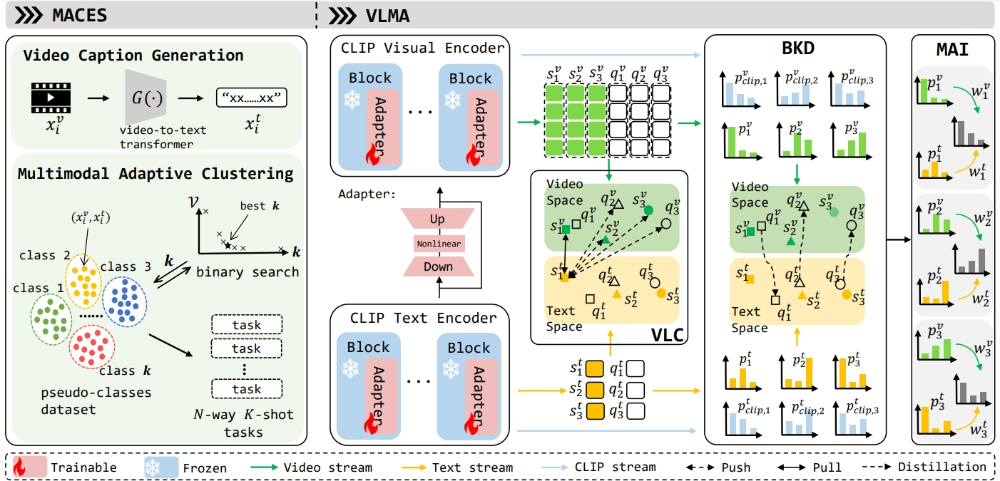

# MECES-VLMA

Jiaxin Chen, Jiawen Peng, Yanzuo Lu, Jian-Huang Lai, Andy J. Ma, “Vision-Language Adaptive Clustering and Meta-Adaptation for Unsupervised Few-Shot Action Recognition,” in TCSVT 2024, under review.

Unsupervised few-shot action recognition is a practical but challenging task, which adapts knowledge learned from unlabeled videos to novel action classes with only limited labeled data. 
Without annotated data of base action classes for meta-learning, it cannot achieve satisfactory performance due to poor pre-trained models.
Directly replacing pre-trained models with CLIP's visual encoder can only lead to limited performance improvements.
This is primarily attributed to the poor quality of the constructed pseudo-classes and episodes, coupled with the absence of textual modality information.
In this paper, we propose fully exploiting the multimodal knowledge of a pre-trained vision-language model such as CLIP in a novel framework for unsupervised video meta-learning. 
Textual modality is automatically generated for each unlabeled video by a video-to-text transformer. 
Multimodal adaptive clustering for episodic sampling (MACES) based on a video-text ensemble distance metric is proposed to accurately estimate pseudo-classes, which constructs high-quality few-shot tasks (episodes) for episodic training. 
Vision-language meta-adaptation (VLMA) is designed for adapting the pre-trained model to novel tasks by category-aware vision-language contrastive learning and confidence-based reliable bidirectional knowledge distillation. 
The final prediction is obtained by multimodal adaptive inference. 
Extensive experiments on four benchmarks demonstrate the superiority of our method for unsupervised few-shot action recognition. 



## Requirements

python3 and torch1.8

## Structure

- backbone: To save the trained models.
- config: The configuration file.
- method: The main files of the code, including the dataset and MECES-VLMA models.
- utils: 
- vcache:
- main.py: Program entrance.

## Dataset


## Train/Test

You can modify main.py to replace different configuration files in the config folder.

```
python main.py
```


